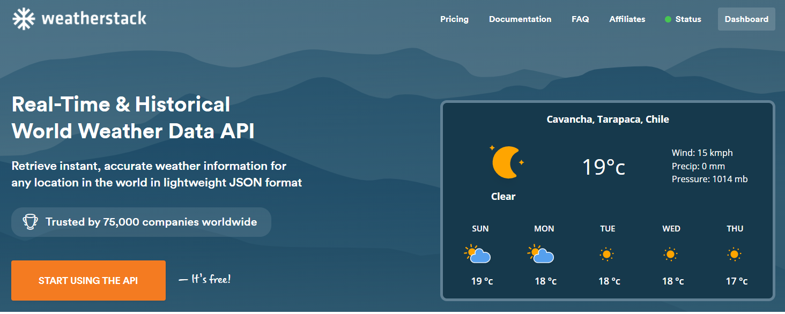
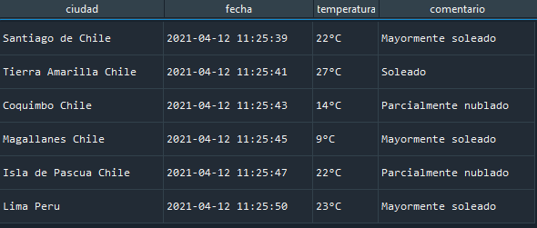

#  Weather API's requests
En desarrollo ...


Repo para probar distintas API's que me entreguen la meteorología de una zona del país.


# Tree

```sh
│   .gitignore
│   keys.json
│   README.md
│
├───apis
│       scrapper.py
│       weatherstack.py
│
├───images
│       scrapper.png
│       weatherstack.png
│
└───src
        scraper_module.py
        __init__.py
```

# 1) Weatherstack

<p align="center">
  
</p>


Hay que hacer una cuenta (capa gratuita), entrega 1000 request por mes y lo bueno es que te entrega varios datos climaticos como, descripciones del clima, inclinación del viento, presión atmosferica, precipitaciones, humedad, oclusión en nubes, indice de rayos uv, visibilidad, velocidad del viento, etc. Bien completa la API, pagando 5 dolares al mes, tienes 50000 requests y acceso a info historica. 


Ejemplo de un request para santiago:


```rust
{
   "request":{
      "type":"City",
      "query":"Santiago, Chile",
      "language":"en",
      "unit":"m"
   },
   "location":{
      "name":"Santiago",
      "country":"Chile",
      "region":"Region Metropolitana",
      "lat":"-33.450",
      "lon":"-70.667",
      "timezone_id":"America/Santiago",
      "localtime":"2021-04-11 22:46",
      "localtime_epoch":1618181160,
      "utc_offset":"-4.0"
   },
   "current":{
      "observation_time":"02:46 AM",
      "temperature":18,
      "weather_code":113,
      "weather_icons":[
         "https://assets.weatherstack.com/images/wsymbols01_png_64/wsymbol_0008_clear_sky_night.png"
      ],
      "weather_descriptions":[
         "Clear"
      ],
      "wind_speed":7,
      "wind_degree":180,
      "wind_dir":"S",
      "pressure":1014,
      "precip":0,
      "humidity":37,
      "cloudcover":0,
      "feelslike":18,
      "uv_index":1,
      "visibility":10,
      "is_day":"no"
   }
}
```

Ejemplo de un request para minera candelaria en tierra amarilla:

```rust
{
   "request":{
      "type":"City",
      "query":"Tierra Amarilla, Chile",
      "language":"en",
      "unit":"m"
   },
   "location":{
      "name":"Tierra Amarilla",
      "country":"Chile",
      "region":"Atacama",
      "lat":"-27.483",
      "lon":"-70.283",
      "timezone_id":"America/Santiago",
      "localtime":"2021-04-11 22:59",
      "localtime_epoch":1618181940,
      "utc_offset":"-4.0"
   },
   "current":{
      "observation_time":"02:59 AM",
      "temperature":12,
      "weather_code":113,
      "weather_icons":[
         "https://assets.weatherstack.com/images/wsymbols01_png_64/wsymbol_0008_clear_sky_night.png"
      ],
      "weather_descriptions":[
         "Clear"
      ],
      "wind_speed":7,
      "wind_degree":100,
      "wind_dir":"E",
      "pressure":1014,
      "precip":0,
      "humidity":82,
      "cloudcover":0,
      "feelslike":12,
      "uv_index":1,
      "visibility":9,
      "is_day":"no"
   }
}

```

# 2) Scraper (La vieja confiable)

Preguntando a google también se puede sacar info metereologíca de manera gratuita


```sh
├───apis
│       scrapper.py  ---> Ejemplo del scraper
└───src
        scraper_module.py --> Modulo
        __init__.py
```

La salida de este scraper es bastante buena, falta agregar más cosas como humedad y viento, pero para más adelante cuando sea necesario.


```rust
{
   "ciudad":{
      "0":"Santiago de Chile",
      "1":"Tierra Amarilla Chile",
      "2":"Coquimbo Chile",
      "3":"Magallanes Chile",
      "4":"Isla de Pascua Chile",
      "5":"Lima Peru"
   },
   "fecha":{
      "0":"2021-04-12 11:25:39",
      "1":"2021-04-12 11:25:41",
      "2":"2021-04-12 11:25:43",
      "3":"2021-04-12 11:25:45",
      "4":"2021-04-12 11:25:47",
      "5":"2021-04-12 11:25:50"
   },
   "temperatura":{
      "0":"22°C",
      "1":"27°C",
      "2":"14°C",
      "3":"9°C",
      "4":"22°C",
      "5":"23°C"
   },
   "comentario":{
      "0":"Mayormente soleado",
      "1":"Soleado",
      "2":"Parcialmente nublado",
      "3":"Mayormente soleado",
      "4":"Parcialmente nublado",
      "5":"Mayormente soleado"
   }
```

<p align="center">
  
</p>


# Bibliografía

* [1] https://devresourc.es/
* [2] https://weatherstack.com/
